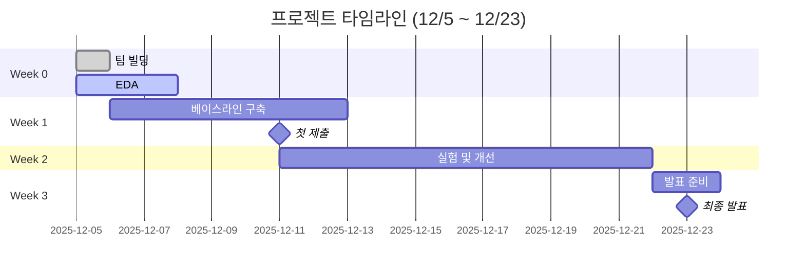

# 코드잇 8팀 - 알약 검출 프로젝트

<div align="center">


**목표**: 알약 이미지에서 최대 4개 검출 (Object Detection)

**기간**: 3주 | **평가**: Kaggle Private Competition

</div>

---

## 팀원

| 역할 | 이름 | GitHub | 상태 |
|:----:|:-----|:-------|:----:|
| **Leader** | 이진석 | [@Jin94-ai](https://github.com/Jin94-ai) |  |
| **Data Engineer** | 김민우, 김나연 | @mw-kim @ny-kim |  |
| **Model Architect** | 김보윤 | @by-kim |  |
| **Experimentation Lead** | 황유민 | @ym-hwang |  |
| **Integration Specialist** | 이진석 | [@Jin94-ai](https://github.com/Jin94-ai) |  |

> 역할 상세: [TEAM_ROLES.md](TEAM_ROLES.md)

---

## 진행 현황



**체크리스트**:
- [x] 팀 구성 완료 (12/5)
- [x] 첫 미팅 완료 (12/5)
- [x] EDA 완료 (12/8 - 나연님, 민우님)
- [x] 데이터 전처리 전략 수립 (12/8)
- [x] YOLO 변환 모듈 구축 (12/8 - 민우님)
- [ ] 베이스라인 모델 구축 (12/10까지 - 보윤님)
- [ ] 첫 Kaggle 제출 (12/11)
- [ ] 실험 및 개선 (12/11-21)
- [ ] 최종 발표 (12/23)

---

## 빠른 시작

### 1. 저장소 클론
```bash
git clone https://github.com/Jin94-ai/codeit_team8_project1.git
cd codeit_team8_project1
```

### 2. 환경 설정
```bash
# 가상환경 생성
python -m venv venv

# 활성화 (Windows)
venv\Scripts\activate

# 의존성 설치
pip install -r requirements.txt
```

### 3. 데이터 다운로드
- Kaggle Competition 페이지에서 데이터 다운로드
- `data/` 폴더에 압축 해제

### 4. 시작하기
- 역할 확인: [TEAM_ROLES.md](TEAM_ROLES.md)
- 협업 일지 작성: [logs/collaboration/](logs/collaboration/)
- 회의록 확인: [logs/meetings/](logs/meetings/)

---

## 기술 스택

### Object Detection
- **모델**: YOLOv8 (Ultralytics)
- **프레임워크**: PyTorch

### 데이터 처리
- **증강**: Albumentations
- **전처리**: OpenCV, Pillow

### 실험 추적
- **도구**: TBD (Weights & Biases / MLflow 검토 중)
- **로그**: [logs/experiments/](logs/experiments/)

### 협업
- **버전 관리**: Git, GitHub
- **커뮤니케이션**: Discord
- **일지**: [logs/collaboration/](logs/collaboration/)

---

## 실험 결과

|       ID       | 모델      | mAP@50 | Kaggle Score |     날짜     | 담당  |  상태 |
| :------------: | :------ | :----: | :----------: | :--------: | :-- | :-: |
| Experiment 001 | YOLOv8n |  0.915 |     0.00     | 2025-12-09 | 김보윤 |  완료 |


> 실험 상세: [logs/experiments/](logs/experiments/)

---

## 데이터 현황

### 학습 데이터
- **이미지 수**: 232개 (필터링 완료)
- **어노테이션 수**: 763개
- **클래스 수**: 56개 (테스트셋: 40개)
- **이미지 크기**: 980×1280 (세로형)
- **포맷**: COCO JSON → YOLO TXT

### 주요 특징
- 클래스 불균형: 최소 1개 ~ 최대 80개 (1:80 비율)
- 이미지당 평균 알약 수: 3.28개
- 배경/조명: 단일 환경 (연회색 배경, 주백색 조명)

### 데이터 분할
- **Train/Val 비율**: 8:2 (Stratified split)
- **변환 모듈**: `src/data/yolo_dataset/`

> 상세 분석: [notebooks/ny_eda.ipynb](notebooks/ny_eda.ipynb), [notebooks/mw_eda.ipynb](notebooks/mw_eda.ipynb)

---

## 프로젝트 구조

```
codeit_team8_project1/
├── README.md                    # 프로젝트 메인
├── TEAM_ROLES.md               # 팀 역할 정의
├── requirements.txt            # Python 패키지
├── .gitignore
│
├── logs/                       # 📁 작업 로그
│   ├── collaboration/          # 협업 일지 (날짜별)
│   ├── meetings/              # 회의록 (날짜별)
│   └── experiments/           # 실험 로그 (ID별)
│
├── data/                      # 📁 데이터 (gitignore)
│   ├── train_images/          # 학습 이미지 (232개)
│   ├── train_annotations/     # COCO JSON
│   └── test_images/           # 테스트 이미지 (843개)
│
├── datasets/                  # 📁 변환된 데이터셋
│   └── pills/                 # YOLO 포맷 (gitignore)
│
├── notebooks/                 # 📁 Jupyter 노트북
│   ├── ny_eda.ipynb          # 나연님 EDA
│   └── mw_eda.ipynb          # 민우님 EDA
│
├── src/                       # 📁 소스 코드
│   ├── data/                  # 데이터 처리
│   │   └── yolo_dataset/      # COCO→YOLO 변환 모듈
│   └── models/                # 모델 구현
│
└── scripts/                   # 📁 실행 스크립트
    └── inference.py
```

---

## 주요 링크

- **Kaggle Competition**: [링크 추가 예정]
- **협업 일지**: [logs/collaboration/](logs/collaboration/)
- **회의록**: [logs/meetings/](logs/meetings/)
- **실험 로그**: [logs/experiments/](logs/experiments/)
- **실험 추적 도구 WandB Workspace**: [https://wandb.ai/codeit_team8/codeit_team8]

## 협업 규칙

### 일일 스탠드업
- **시간**: 매일 오전 10시 (15분) - 첫 미팅에서 조정
- **형식**: 어제 한 일, 오늘 할 일, 막힌 점

### 협업 일지
- **작성 주기**: 매일
- **위치**: `logs/collaboration/YYYY-MM-DD_이름.md`
- **가이드**: [logs/collaboration/README.md](logs/collaboration/README.md)

### 주간 회고
- **시간**: 매주 금요일 저녁 (1시간)
- **형식**: KPT (Keep, Problem, Try)

---

## 커밋 메시지 규칙

```
[Week X] 작업 내용

예:
[Week 0] Add first meeting notes
[Week 1] Implement baseline YOLOv8 model
[Week 2] Experiment with data augmentation
```

---

<div align="center">

**8팀 프로젝트 화이팅!**

</div>
