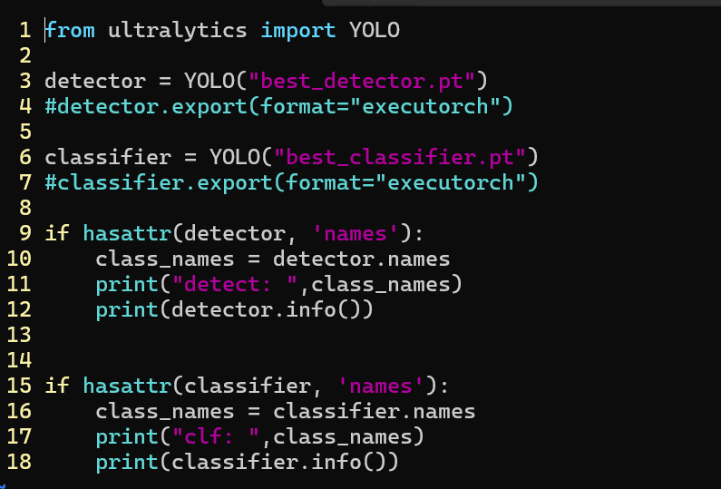
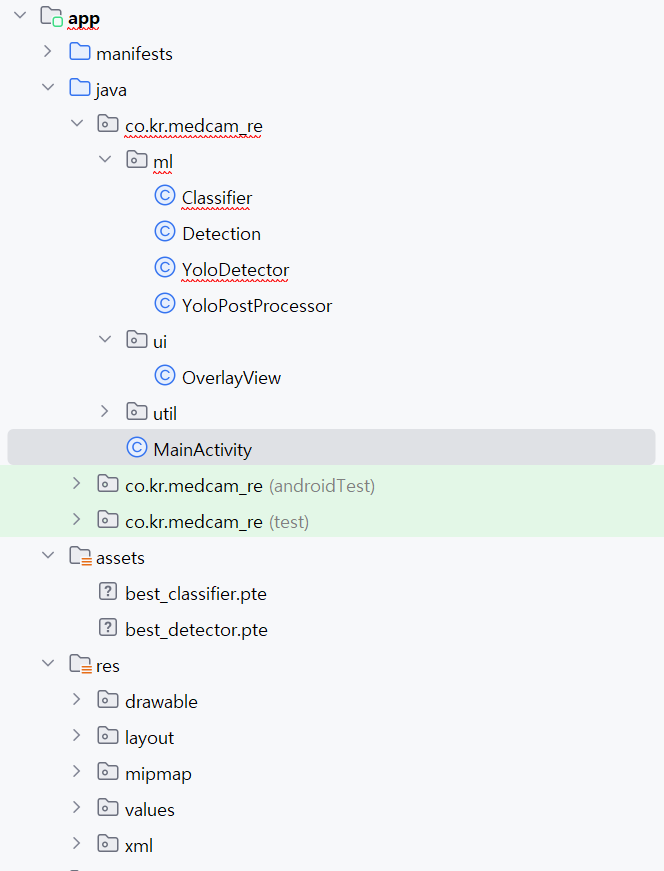
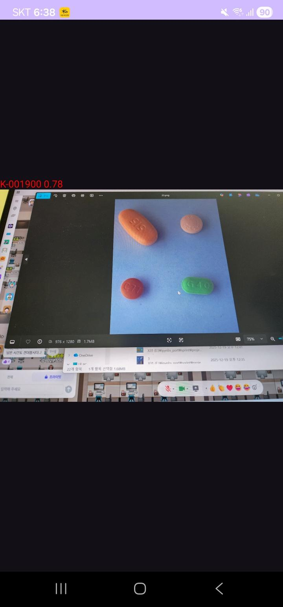
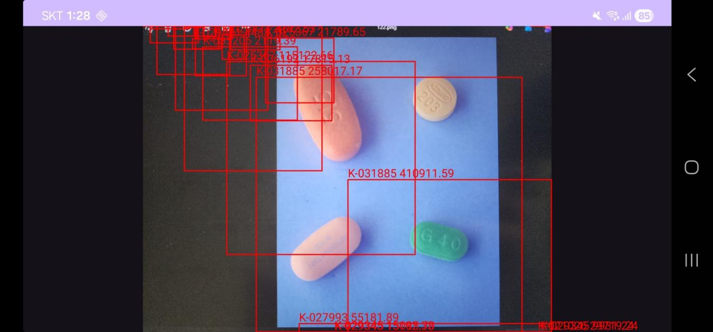

# Android 앱 개발 시도 기록

> 김보윤 작성 - YOLO 모델 모바일 배포 시도 과정

---

## 1. 개발 시도 과정

### 1.1 모델 변환

**.pt 모델을 모바일 플랫폼용 .pte 포맷으로 변환** (ExecuTorch 사용)

```python
from ultralytics import YOLO

detector = YOLO("best_detector.pt")
#detector.export(format="executorch")

classifier = YOLO("best_classifier.pt")
#classifier.export(format="executorch")

if hasattr(detector, 'names'):
    class_names = detector.names
    print("detect: ", class_names)
    print(detector.info())

if hasattr(classifier, 'names'):
    class_names = classifier.names
    print("clf: ", class_names)
    print(classifier.info())
```

**변환 포맷:**
- 입력: `.pt` (PyTorch 모델)
- 출력: `.pte` (ExecuTorch 모바일 포맷)

---

### 1.2 앱 개발 (Android Studio)

**개발 언어:** Java

**앱 동작 흐름:**
```
카메라앱 Intent 호출
    ↓
실시간 이미지 캡처
    ↓
Bitmap 변환
    ↓
YOLO 모델 추론
    ↓
결과 출력 (클래스, 점수, bbox)
```

---

## 2. 프로젝트 구조

```
app/
├── manifests/
├── java/
│   └── co.kr.medcam_re/
│       ├── ml/
│       │   ├── Classifier          # 분류 모델 래퍼
│       │   ├── Detection           # 검출 결과 클래스
│       │   ├── YoloDetector        # YOLO 검출기
│       │   └── YoloPostProcessor   # 후처리 로직
│       ├── ui/
│       │   └── OverlayView         # bbox 오버레이 뷰
│       ├── util/
│       └── MainActivity            # 메인 액티비티
├── assets/
│   ├── best_classifier.pte         # 분류 모델 (변환됨)
│   └── best_detector.pte           # 검출 모델 (변환됨)
└── res/
    ├── drawable/
    ├── layout/
    ├── mipmap/
    ├── values/
    └── xml/
```

**핵심 클래스:**
| 클래스 | 역할 |
|--------|------|
| `YoloDetector` | YOLO 모델 로드 및 추론 |
| `YoloPostProcessor` | NMS, bbox 후처리 |
| `Classifier` | 크롭 이미지 분류 |
| `Detection` | 검출 결과 데이터 클래스 |
| `OverlayView` | 화면에 bbox 렌더링 |
| `MainActivity` | 카메라 연동 및 UI 제어 |

---

## 3. 실행 결과

### 결과 1: 단일 알약 인식
- **인식 클래스:** K-001900
- **신뢰도:** 0.78 (78%)
- **상태:** 정상 검출

### 결과 2: 다중 알약 인식 (bbox 표시)
- 여러 알약 동시 검출
- 각 알약별 K-code 및 신뢰도 표시
- bbox 오버레이 정상 동작

**검출된 알약 예시:**
| K-code | 신뢰도 |
|--------|--------|
| K-031885 | 41.09% |
| K-027993 | 55.18% |
| 기타 | 다수 |

---

## 4. 기술 스택

| 항목 | 기술 |
|------|------|
| 플랫폼 | Android |
| 언어 | Java |
| IDE | Android Studio |
| ML 프레임워크 | ExecuTorch |
| 모델 | YOLO11 (.pte 변환) |
| 카메라 | Android Camera Intent |

---

## 5. 이미지

### 5.1 모델 변환 코드


### 5.2 Android Studio 프로젝트 구조


### 5.3 앱 실행 결과 - 단일 알약 인식

- K-001900 인식, 신뢰도 0.78

### 5.4 앱 실행 결과 - 다중 알약 + BBox

- 여러 알약 동시 검출
- bbox 오버레이 표시

---

## 6. 한계점 및 개선 방향

### 현재 한계
- ExecuTorch 변환 시 일부 연산자 미지원
- 모바일 환경에서의 추론 속도 최적화 필요
- 2-Stage Pipeline의 모바일 구현 복잡성

### 향후 개선 방향
- ONNX Runtime 또는 TensorFlow Lite 변환 검토
- 모델 경량화 (Quantization)
- 실시간 카메라 프리뷰 + 추론 통합

---

*작성일: 2025-12-23*
