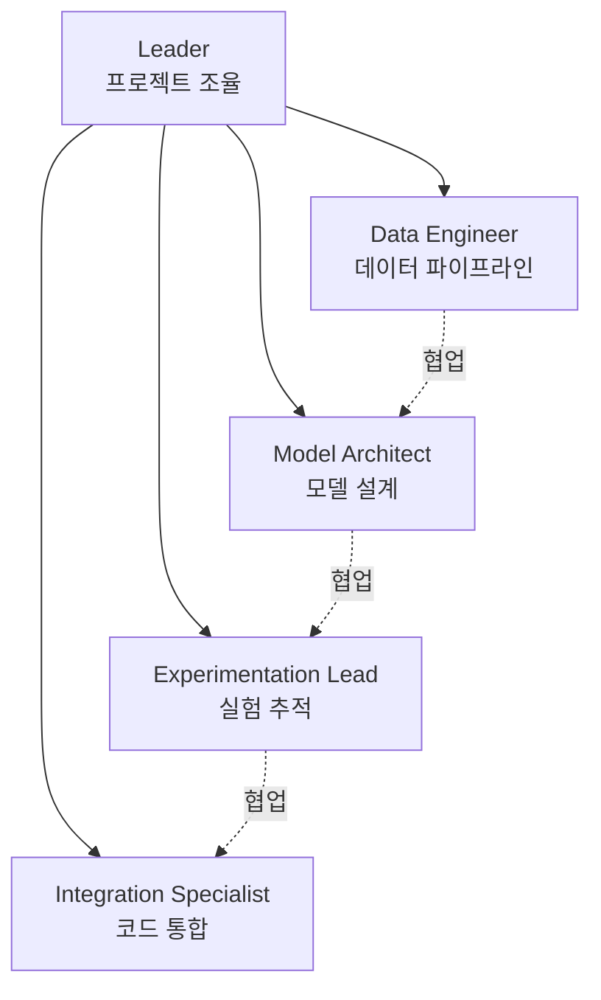

# 첫 팀 모임 체크리스트

**목표**: 팀 빌딩, 역할 분배, 기술 스택 결정

---

## 미팅 전 준비 (리더)

### 필수 준비 사항

- [ ] 미팅 일정 확정 및 공지
- [ ] 아젠다 공유 (Discord/Slack)
- [ ] 필수 문서 링크 정리
  - [ ] README.md
  - [ ] QUICK_START.md
  - [ ] TEAM_ROLES.md
- [ ] 기술 스택 선택지 준비 (아래 참고)
- [ ] 타이머 준비 (시간 관리용)

### 선택 준비 사항

- [ ] Kaggle Competition 페이지 확인
- [ ] 참고 프로젝트 리서치
- [ ] 질문 사항 정리

---

## 미팅 아젠다 (60분)

```mermaid
gantt
    title 첫 팀 모임 일정
    dateFormat HH:mm
    section 자기소개
    자기소개 (25분)    :00:00, 25m
    section 프로젝트
    개요 설명 (10분)   :00:25, 10m
    section 결정사항
    기술 스택 (10분)   :00:35, 10m
    역할 분배 (10분)   :00:45, 10m
    section 마무리
    다음 일정 (5분)    :00:55, 5m
```

---

## Part 1: 자기소개 (25분)

### 각자 공유 (5분씩)

**공유 항목**:
- 이름 및 배경
- 강점 (잘하는 것)
- 관심사 (배우고 싶은 것)
- 프로젝트에서 기대하는 것

**리더 역할**:
- [ ] 시간 체크 (각 5분)
- [ ] 적극적 경청
- [ ] 강점 메모 (역할 분배에 활용)

---

## Part 2: 프로젝트 개요 (10분)

### 설명 내용

<b>프로젝트 목표</b>

**비즈니스 컨텍스트**:
- 헬스케어 스타트업 "헬스잇(Health Eat)"
- 알약 사진 → 자동 인식 시스템

**기술적 목표**:
- Object Detection 모델 개발
- 최대 4개 알약 검출 (클래스 + 바운딩 박스)
- Kaggle Competition 평가

**일정**:
- Week 1: 베이스라인 구축
- Week 2: 실험 및 개선
- Week 3: 완성 및 발표

### 체크리스트

- [ ] 프로젝트 목표 설명
- [ ] 기술적 과제 설명
- [ ] 3주 타임라인 공유
- [ ] 질문 받기

---

## Part 3: 기술 스택 결정 (10분)

### 1. Object Detection 모델 선택

<table>
<tr>
<th width="20%">모델</th>
<th width="30%">특징</th>
<th width="25%">장점</th>
<th width="25%">단점</th>
</tr>
<tr>
<td>

**YOLOv8**

</td>
<td>

- 실시간 검출
- Pre-trained 모델 풍부
- Ultralytics 라이브러리

</td>
<td>

+ 빠른 학습/추론
+ 사용 편리
+ 문서 풍부

</td>
<td>

- 작은 객체 검출 약함
- 정확도 trade-off

</td>
</tr>
<tr>
<td>

**Faster R-CNN**

</td>
<td>

- 높은 정확도
- 2-stage detector
- torchvision 지원

</td>
<td>

+ 높은 mAP
+ 작은 객체 강함

</td>
<td>

- 학습 시간 김
- 추론 속도 느림

</td>
</tr>
<tr>
<td>

**EfficientDet**

</td>
<td>

- 효율성 최적화
- Compound scaling
- 다양한 크기

</td>
<td>

+ 성능/속도 균형
+ 메모리 효율

</td>
<td>

- 설정 복잡
- 커스터마이징 어려움

</td>
</tr>
</table>

**팀 투표**:
- [ ] YOLOv8 (추천)
- [ ] Faster R-CNN
- [ ] EfficientDet
- [ ] 기타: ___________

**결정**: _____________

### 2. 딥러닝 프레임워크 선택

<table>
<tr>
<th width="30%">프레임워크</th>
<th width="35%">장점</th>
<th width="35%">단점</th>
</tr>
<tr>
<td>

**PyTorch**

</td>
<td>

+ Pythonic, 직관적
+ 디버깅 쉬움
+ 연구 커뮤니티 활발
+ YOLO Ultralytics 지원

</td>
<td>

- 배포 상대적 복잡
- 버전 호환성 이슈

</td>
</tr>
<tr>
<td>

**TensorFlow/Keras**

</td>
<td>

+ 배포 편리 (TF Serving)
+ Keras API 간단
+ 산업 표준
+ 문서 풍부

</td>
<td>

- 디버깅 어려움
- Eager mode 필요
- 복잡한 구조

</td>
</tr>
</table>

**팀 투표**:
- [ ] PyTorch (추천)
- [ ] TensorFlow/Keras

**결정**: _____________

### 3. 데이터 증강 라이브러리

<table>
<tr>
<th width="30%">라이브러리</th>
<th width="35%">특징</th>
<th width="35%">추천 용도</th>
</tr>
<tr>
<td>

**Albumentations**

</td>
<td>

- 빠른 속도
- Object Detection 최적화
- Bounding box 자동 변환

</td>
<td>

**추천**: Object Detection
- 바운딩 박스 함께 증강
- 다양한 transform

</td>
</tr>
<tr>
<td>

**torchvision.transforms**

</td>
<td>

- PyTorch 내장
- 간단한 사용
- 기본 증강 지원

</td>
<td>

**추천**: 간단한 경우
- 빠른 프로토타이핑

</td>
</tr>
<tr>
<td>

**imgaug**

</td>
<td>

- 다양한 증강 기법
- 시각화 편리

</td>
<td>

**추천**: 실험적 증강
- 특수한 효과 필요 시

</td>
</tr>
</table>

**팀 투표**:
- [ ] Albumentations (추천)
- [ ] torchvision.transforms
- [ ] imgaug

**결정**: _____________

### 4. 실험 추적 도구

<table>
<tr>
<th width="30%">도구</th>
<th width="35%">장점</th>
<th width="35%">단점</th>
</tr>
<tr>
<td>

**Weights & Biases**

</td>
<td>

+ 시각화 훌륭
+ 실시간 추적
+ 협업 기능 강력
+ 무료 tier 충분

</td>
<td>

- 인터넷 필요
- 민감 데이터는 로컬 권장

</td>
</tr>
<tr>
<td>

**MLflow**

</td>
<td>

+ 완전 로컬 가능
+ 모델 레지스트리
+ 배포 지원

</td>
<td>

- UI 상대적 단순
- 설정 필요

</td>
</tr>
<tr>
<td>

**TensorBoard**

</td>
<td>

+ PyTorch/TF 통합
+ 무료, 로컬
+ 간단한 사용

</td>
<td>

- 협업 기능 약함
- 고급 기능 부족

</td>
</tr>
</table>

**팀 투표**:
- [ ] Weights & Biases (추천)
- [ ] MLflow
- [ ] TensorBoard
- [ ] 간단한 로그 파일

**결정**: _____________

### 5. 협업 도구

<table>
<tr>
<th width="30%">도구</th>
<th width="70%">용도</th>
</tr>
<tr>
<td>

**Discord / Slack**

</td>
<td>

**필수**: 일일 스탠드업, 실시간 소통
- 음성 채널
- 스크린 공유
- 파일 공유

</td>
</tr>
<tr>
<td>

**Notion / Google Docs**

</td>
<td>

**선택**: 문서 협업
- 회의록
- 실험 로그 공유 (W&B 대체 시)
- 일정 관리

</td>
</tr>
<tr>
<td>

**GitHub**

</td>
<td>

**필수**: 코드 버전 관리
- Pull Request 리뷰
- Issue 추적
- 문서 호스팅 (README)

</td>
</tr>
</table>

**팀 투표**:
- [ ] Discord
- [ ] Slack
- [ ] 기타: ___________

**결정**: _____________

---

## Part 4: 역할 분배 (10분)

### 역할별 주요 책임

### 역할 지원 현황

<table>
<tr>
<th width="30%">역할</th>
<th width="35%">주요 작업</th>
<th width="35%">지원자</th>
</tr>
<tr>
<td>

**Leader**
(확정: 이진석)

</td>
<td>

- 프로젝트 조율
- 의사결정 촉진
- 코드 통합
- 발표 준비

</td>
<td>

✅ 이진석

</td>
</tr>
<tr>
<td>

**Data Engineer**

</td>
<td>

- EDA
- 데이터 전처리
- 데이터 증강
- 파이프라인 구축

</td>
<td>

[ ] __________

</td>
</tr>
<tr>
<td>

**Model Architect**

</td>
<td>

- 모델 리서치
- 베이스라인 구축
- 아키텍처 설계
- Transfer Learning

</td>
<td>

[ ] __________

</td>
</tr>
<tr>
<td>

**Experimentation Lead**

</td>
<td>

- 실험 추적 시스템
- 하이퍼파라미터 튜닝
- 성능 평가
- 실험 로그 관리

</td>
<td>

[ ] __________

</td>
</tr>
<tr>
<td>

**Integration Specialist**

</td>
<td>

- 코드 리뷰
- PR 통합
- 추론 파이프라인
- Kaggle 제출

</td>
<td>

[ ] __________

</td>
</tr>
</table>

### 역할 결정 방법

1. **강점 기반 매칭**
   - 자기소개에서 언급한 강점 고려
   - 관심사와 역할 매칭

2. **자발적 지원 우선**
   - 하고 싶은 역할 먼저 말하기
   - 겹치면 논의

3. **유연성 유지**
   - 역할은 가이드라인일 뿐
   - 필요시 서로 도움

### 체크리스트

- [ ] 모든 역할 배정 완료
- [ ] 각자 역할 이해 확인
- [ ] 협업 필요 사항 논의

---

## Part 5: 다음 일정 (5분)

### 즉시 다음 일정

**다음 미팅**:
- [ ] 날짜/시간: ___________
- [ ] 주제: 환경 설정 확인 & 데이터 EDA
- [ ] 준비 사항:
  - [ ] 개발 환경 설정 완료
  - [ ] 데이터 다운로드
  - [ ] 기본 EDA 시작

**일일 스탠드업**:
- [ ] 시간: ___________
- [ ] 장소: Discord/Slack
- [ ] 형식: 각자 3분 (어제/오늘/Blocker)

### 작업 분배

**Week 1 Day 1-2 목표**:

| 역할 | 작업 | 기한 |
|------|------|------|
| **전체** | 개발 환경 설정 | 내일까지 |
| **Leader** | GitHub Repository 생성 | 오늘 |
| **Data Engineer** | 데이터 다운로드 및 확인 | 내일까지 |
| **Model Architect** | YOLO 문서 읽기 | 내일까지 |
| **Experimentation Lead** | W&B 계정 생성 | 내일까지 |
| **Integration Specialist** | Git 브랜치 전략 제안 | 내일까지 |

---

## 미팅 후 체크리스트 (리더)

### 즉시 (오늘)

- [ ] 회의록 작성 및 공유
- [ ] 결정 사항 문서화
  - [ ] 기술 스택
  - [ ] 역할 분배
  - [ ] 다음 일정
- [ ] TEAM_ROLES.md 업데이트
- [ ] GitHub Repository 생성
- [ ] 팀원 초대

### 내일까지

- [ ] requirements.txt 작성
- [ ] .gitignore 설정
- [ ] README.md 업데이트 (팀원 정보)
- [ ] 첫 스탠드업 리마인드

---

## 기술 스택 결정 요약

### 최종 결정 기록

<table>
<tr>
<th width="30%">항목</th>
<th width="40%">결정</th>
<th width="30%">비고</th>
</tr>
<tr>
<td>Object Detection 모델</td>
<td>[ ] _________</td>
<td></td>
</tr>
<tr>
<td>딥러닝 프레임워크</td>
<td>[ ] _________</td>
<td></td>
</tr>
<tr>
<td>데이터 증강</td>
<td>[ ] _________</td>
<td></td>
</tr>
<tr>
<td>실험 추적</td>
<td>[ ] _________</td>
<td></td>
</tr>
<tr>
<td>협업 도구</td>
<td>[ ] _________</td>
<td></td>
</tr>
</table>

---

**미팅 완료 후 업데이트 필요**:
- SESSION_STATUS.md
- TEAM_ROLES.md
- README.md

